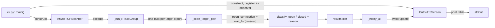

# How async-port-scanner works

A guided tour of the application for contributors. It is a TCP
Connect scanner: every probe is a real three-way handshake made
through the operating system's normal socket API
(`asyncio.open_connection()`), not a raw-socket SYN scan — so, unlike
many port scanners, it needs no elevated privileges to run.

## The scan lifecycle



- **[`cli.py`](src/async_port_scanner/cli.py)** parses the CLI
  arguments (`build_arg_parser`), expands the `-p/--ports` string into
  concrete port numbers (`parse_ports` — a generator, so a huge range
  like `1-65535` doesn't materialize a list before scanning starts),
  and builds the `AsyncTCPScanner`. Invalid ports or ranges exit via
  `SystemExit` with a message, not an unhandled traceback. `main()`
  constructs `OutputToScreen` — which registers itself with the
  scanner — *before* calling `scanner.execute()`, so the observer is
  always in place before any result exists.
- **[`core.py`](src/async_port_scanner/core.py)** defines
  `AsyncTCPScanner`, the scan engine. `execute()` is the only sync
  entry point (`asyncio.run(self._run())`); everything else is a
  coroutine. `_run()` opens one `asyncio.TaskGroup` and schedules a
  `_scan_target_port()` task for every `(port, target)` pair up
  front — see "Concurrency" below for why there's no cap on that — and
  measures the whole run with the `_timer()` context manager
  (`total_time`, used in the final output line).
- **[`output.py`](src/async_port_scanner/output.py)** defines the
  `Output` interface and its one implementation, `OutputToScreen` —
  see "The observer pattern" below.

## Timeouts and failure classification

`_scan_target_port()` wraps `asyncio.open_connection(address, port)`
in `asyncio.wait_for(timeout=self.timeout)`, so a single hung or
filtered port can never block the scan past `--timeout` seconds
regardless of what the network does. Every outcome lands in one of
two states:

- **open** — the connection succeeded; the socket is closed
  immediately afterward (the scanner only needs to know the handshake
  completed, not to hold the connection open).
- **closed**, with a `reason` that distinguishes *why*:
  `ConnectionRefusedError` → `"Connection refused"`, a bare
  `TimeoutError` (the `wait_for` expiring) → `"No response"`, and any
  other `OSError` (DNS failure, unreachable network, etc.) →
  `"Network error"`.

The service name shown alongside each result comes from
`socket.getservbyport(port)`, falling back to `"unknown"` on
`OSError` for ports with no registered name.

## Concurrency, and the no-cap tradeoff

`_run()` schedules every target-port combination as its own task in a
single `TaskGroup`, with no maximum-concurrency limit. That keeps the
scan engine to a few lines and makes a 1000-port sweep finish in well
under a second (see
[Application Performance](README.md#application-performance) in the
README) — but it also means a large scan bursts a large number of
near-simultaneous connection attempts at the target. That tradeoff is
intentional and already documented in the README's ADVISORY; it isn't
revisited at length here, and it isn't a bug to fix without a scope
discussion first (see [CONTRIBUTING.md](CONTRIBUTING.md#scope)).

## The observer pattern, and adding new outputs

`AsyncTCPScanner` never imports `output.py` at runtime — it only
knows about the `Output` interface via a `TYPE_CHECKING`-only import,
used purely for the type hint on `self._observers`. `Output.__init__`
registers the instance with its `subject` (the scanner) as a side
effect of construction, which is why `cli.py` builds `OutputToScreen`
before calling `execute()`. Once every scan task finishes,
`_notify_all()` runs every registered observer's `update()` coroutine
in its own `TaskGroup` and awaits them together.

`OutputToScreen` is the only implementation today: it prints a
formatted table of `PORT | STATE | SERVICE | REASON` per target,
sorted by port number, optionally filtered to open-only results via
`show_open_only`. The interface exists so a second output (JSON,
NDJSON, a file) could register alongside or instead of it without
`core.py` changing at all — that decoupling is the reason the observer
pattern is here instead of a plain function call.

## Testing

The suite (`tests/`) never touches a real network host:
`open_port` and `closed_port` in
[`tests/conftest.py`](tests/conftest.py) bind ephemeral ports on
`127.0.0.1` to produce a reliably-open and a reliably-refused target
for each test. Run the same checks CI does:

```
uv run ruff check
uv run ruff format --check
uv run mypy
uv run pytest
```
